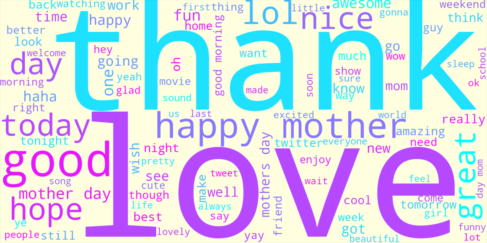

# Sentiment Analysis Comparison

This project explores different approaches to sentiment analysis, comparing traditional rule-based sentiment analyzers (VADER and TextBlob) with a machine learning model (Logistic Regression using TF-IDF features). The goal was to evaluate each method’s performance and understand their strengths and weaknesses across different types of text data.

## Project context

This work was conducted as a personal submission for the Programming for Data Science course at International Hellenic University. 

## Project Overview

- Exploratory Data Analysis (EDA) and data preprocessing  
- Implementation and comparison of multiple sentiment analysis models  
- Visualization including word clouds and confusion matrices  
- Evaluation metrics: Accuracy, Precision, Recall, F1-Score  

## Dataset

The dataset is sourced from [Sentiment Analysis Dataset](https://www.kaggle.com/datasets/abhi8923shriv/sentiment-analysis-dataset). 

## Insights

- Rule-based analyzers often misclassify neutral text as positive.
- Logistic Regression performed better, especially in nuanced or sarcastic contexts.
- Combining human-readable methods like word clouds with model predictions offered valuable interpretation.
